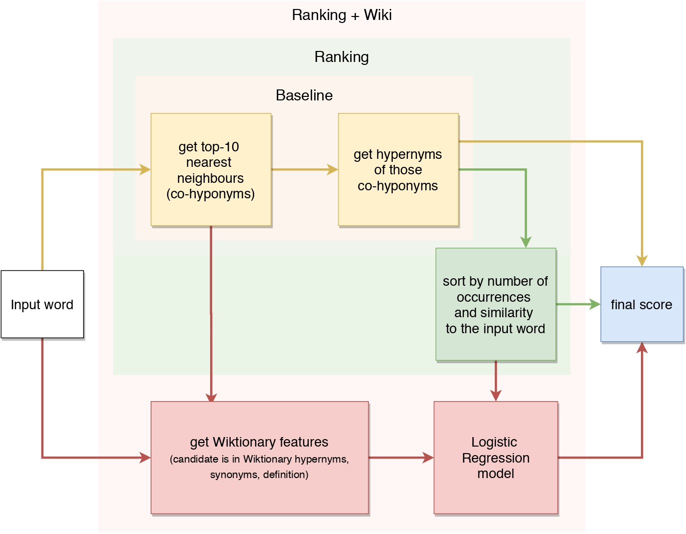

# Studying Taxonomy Enrichment on Diachronic WordNet Versions

This repository contains code and dataset for the Taxonomy Enrichment task for English and Russian. For a new word, our methods predict the top-10 candidate hypernyms from an existing taxonomy.

Detailed description of the methods is available in the original paper:

* Original paper (to be published soon at COLING 2020)
* Poster (to be published soon at COLING 2020)

The picture below illustrates the main idea of the underlying approach:



If you use the method please cite the following paper:

```
@InProceedings{nikishina-etal-2020-studying,
  author    = {Nikishina, Irina  and  Panchenko, Alexander  and  Logacheva, Varvara  and  Loukachevitch, Natalia},
  title     = {Studying Taxonomy Enrichment on Diachronic WordNet Versions},
  booktitle = {Proceedings of the 28th International Conference on Computational Linguistics},
  month     = {December},
  year      = {2020},
  address   = {Barcelona, Spain},
  publisher = {Association for Computational Linguistics},
  pages     = {},
  url       = {},
  abstract  = {Ontologies, taxonomies, and thesauri are used in many NLP tasks. %have always been in high demand in a large number of NLP tasks. However, most studies are focused on the creation of these lexical resources rather than the maintenance of the existing ones. Thus, we address the problem of taxonomy enrichment. We explore the possibilities of taxonomy extension in a resource-poor setting and present methods which are applicable to a large number of languages. We create novel English and Russian datasets for training and evaluating taxonomy enrichment models and describe a technique of creating such datasets for other languages.}
}
```

## Datasets

We build two diachronic datasets: one for English, another one for Russian based respectively on Princeton WordNet and RuWordNet taxonomies. Each dataset consists of a taxonomy and a set of novel words not included in the taxonomy. 

### Datasets can be downloaded [here](https://doi.org/10.5281/zenodo.4270478)

Statistics:

|     Dataset       | Nouns    | Verbs |
| :-------------:   | :---:    | :---: |
| WordNet 1.6-3.0   |  17 043  |  755  |
| WordNet 1.7-3.0   |  6 161   |  362  |
| WordNet 2.0-3.0   |  2 620   |  193  |
| RuWordNet 1.0-2.0 |  14 660  | 2 154 |


## Usage

```
git clone --recursive https://github.com/skoltech-nlp/diachronic-wordnets.git
```

### Baseline

In this method, top  nearest neighbours of the input word are taken from the pre-trained embedding model (according to the above considerations they should be co-hyponyms). Subsequently,  hypernyms  of those co-hyponyms are extracted from the taxonomy. These hypernyms can also be considered hypernyms of the input word. 


### Ranking

We improve the described model by ranking the generated synset candidates. In addition to that, we extend the list of candidates with second-order hypernyms (hypernyms of each hypernym). The direct hypernyms of the word's nearest neighbours can be too specific, whereas second-order hypernyms are likely to be more abstract concepts, which the input word and its neighbours have in common. After forming a list of candidates, we score each of them using the following equation:


where  is a vector representation of a word or a synset ,  is a hypernym,  is the number of occurrences of this hypernym in the merged list,  is the cosine similarity of the vector of the orphan word  and hypernym vector .


### Ranking + wiki 

